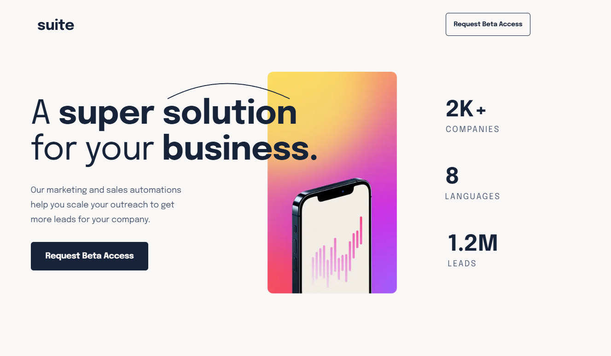
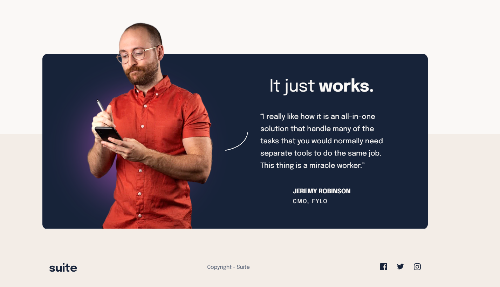

🧠 Suite Landing Page

A responsive Suite Landing Page built as part of a Frontend Mentor challenge.
The project focuses on creating a modern SaaS-style UI with strong layout structure and responsive design.

🚀 Features

- Modern SaaS landing page layout
- Hero section with headline and CTA
- Statistics section (companies, languages, leads)
- Testimonial section
- Call-to-action buttons
- Responsive layout (mobile → desktop)
- Clean and structured UI design

| Technology             | Purpose                 |
| ---------------------- | ----------------------- |
| **HTML5**              | Semantic page structure |
| **CSS3**               | Styling and layout      |
| **Flexbox / CSS Grid** | Layout alignment        |
| **GitHub Pages**       | Deployment              |

📸 Sections

Hero Section

Footer Section

